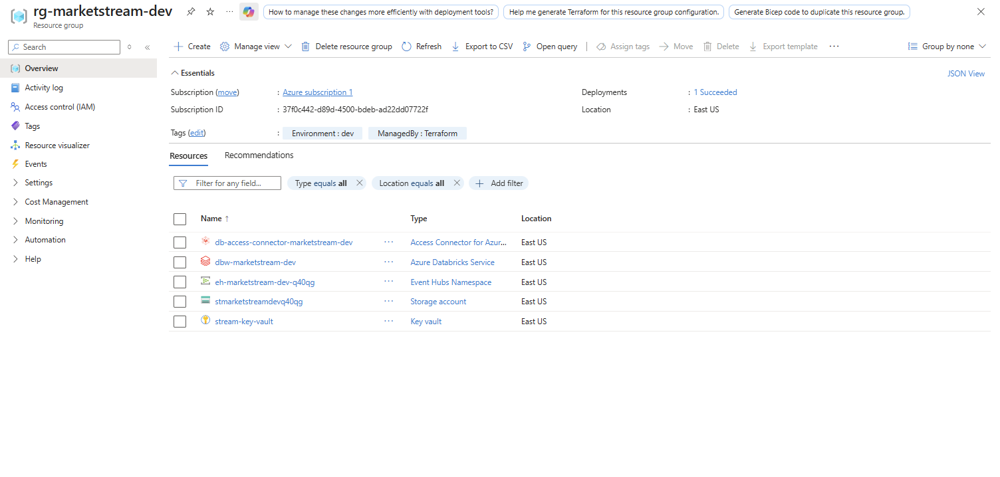
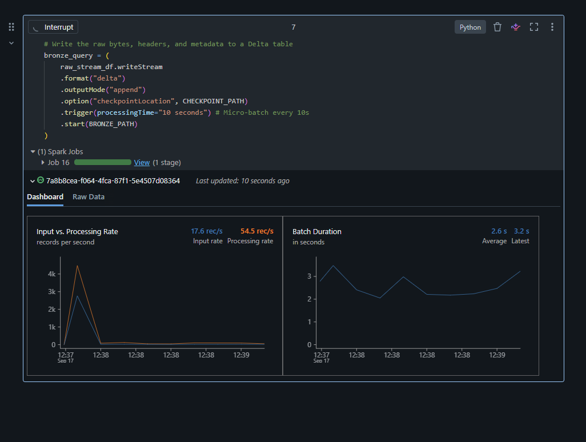
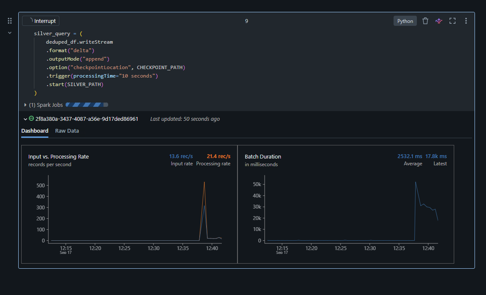
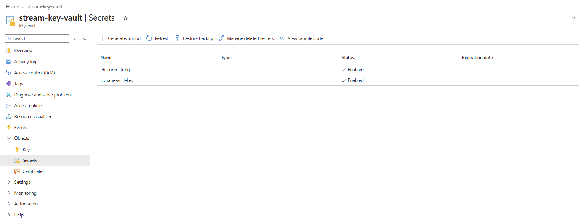
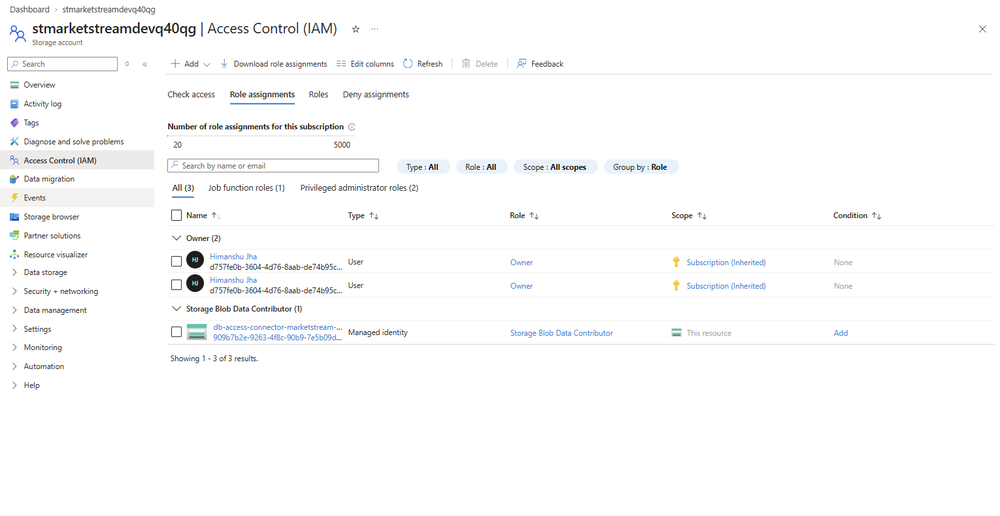
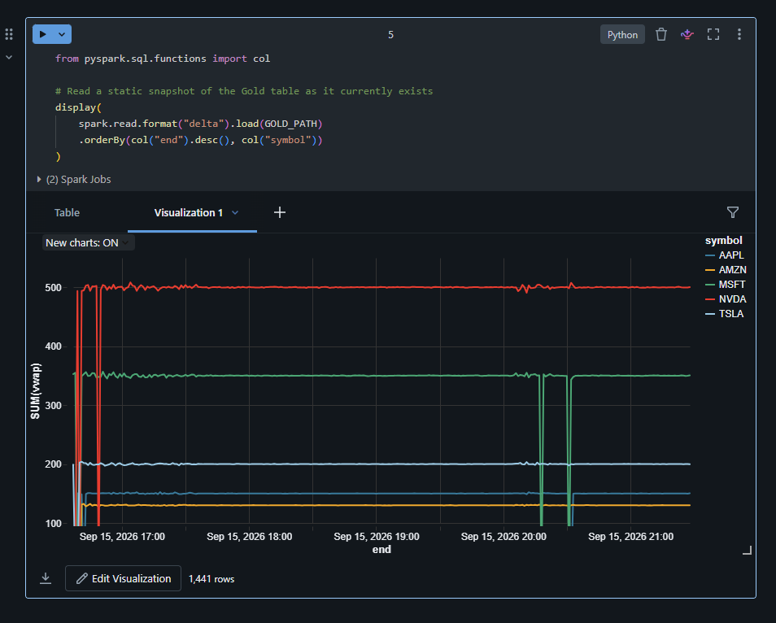

# Enterprise Real-Time Market Data Pipeline (Medallion Architecture)

## 📌 Project Overview
A production-grade, real-time streaming data pipeline processing financial market trades. Built entirely on Azure, this project implements a **Medallion Architecture (Bronze, Silver, Gold)** using **PySpark Structured Streaming** and **Databricks**. 

The architecture is governed by strict enterprise security standards (Azure Key Vault, RBAC, Managed Identities) and deployed via Infrastructure as Code (Terraform) to ensure scalable, cost-aware cloud operations.

*Azure Resource Group deployed via Terraform containing the complete pipeline infrastructure.*

### Key Business Value
*   **Real-Time Analytics:** Processes live JSON trade data into a 1-minute tumbling window Volume-Weighted Average Price (VWAP) dashboard.
*   **Zero-Trust Security:** Eliminates all hardcoded credentials via dynamic Azure Key Vault injection, Managed Identities, and segregated SAS network policies.
*   **FinOps & Automation:** Fully automated provisioning and teardown using Terraform to maintain a zero-cost baseline when idle.

---

## 🛠️ Technology Stack
*   **Compute & Processing:** Azure Databricks, PySpark Structured Streaming, Delta Lake
*   **Message Broker:** Azure Event Hubs (Kafka API)
*   **Storage & State:** Azure Data Lake Storage Gen2 (ADLS)
*   **Security & IAM:** Azure Key Vault, Azure Active Directory (RBAC)
*   **Infrastructure & FinOps:** Terraform, Azure CLI
*   **Languages:** Python, SQL

---

## 🚀 Phase 1: Infrastructure as Code & Data Generation

### 1. Automated Cloud Provisioning
Instead of manually configuring the Azure Portal, I built a modular Terraform configuration (`main.tf`) to deploy the entire environment. This ensures reproducibility and adheres to enterprise CI/CD standards.
*   Provisioned an **Event Hubs Namespace** with dedicated Kafka topics.
*   Deployed an **ADLS Gen2 Storage Account** configured with hierarchical namespaces for Delta tables.
*   Spun up an **Azure Databricks Workspace**, a secure **Azure Key Vault**, and an **Access Connector for Azure Databricks**.

### 2. The Chaos Data Producer
Developed a local Python script (`market_producer.py`) utilizing the `confluent-kafka` library to simulate high-velocity financial trades. The script asynchronously publishes JSON payloads containing `trade_id`, `symbol`, `price`, and `volume` over port 9093 directly to Azure Event Hubs.

---

## 🧠 Phase 2: PySpark Medallion Streaming & Security Hardening

This phase involved building the core streaming engine in Databricks and resolving complex cloud networking, security, and state management challenges.

### The Medallion Pipeline
1.  **Bronze Layer (Ingestion):** A continuous Spark read stream subscribing to Event Hubs, persisting raw JSON bytes into an immutable Delta table as the system of record.
2.  **Silver Layer (Cleansing):** Applied explicit schema enforcement, unpacked JSON payloads, handled late-arriving data using `.withWatermark("timestamp", "5 minutes")`, and dropped duplicate `trade_id` events.
3.  **Gold Layer (Aggregation):** Executed a stateful aggregation using `.window("timestamp", "1 minute")` to calculate the real-time VWAP, grouped by stock ticker.

*Bronze Layer actively ingesting raw JSON bytes from Azure Event Hubs.*

*Silver Layer processing micro-batches, enforcing schema, and applying watermarks.*

### Enterprise Security & Troubleshooting Log
This pipeline was built to pass stringent security reviews. Implementing this resulted in several real-world engineering hurdles that I successfully diagnosed and resolved:

*   **Key Vault RBAC Isolation (403 Forbidden):** Databricks initially failed to fetch secrets. I identified the separation between Azure's Control Plane and Data Plane, ultimately assigning the `Key Vault Secrets User` role to the Databricks Enterprise Application via RBAC.
*   **Dynamic Storage Credential Injection (Error 58030):** To allow Spark to write checkpoint files to ADLS Gen2 securely, I designed a runtime injection method utilizing `dbutils.secrets.get()` and passing the token directly into `spark.conf.set()`.
*   **Managed Identity Access:** Configured the Databricks Access Connector as a `Storage Blob Data Contributor` to ensure secure, passwordless read/write access to the Data Lake.
*   **Kafka Network Routing & SAS Token Scopes:** The ingestion stream suffered from repeated TCP node disconnects (`TimeoutException`). I diagnosed this as an Event Hubs authorization drop. I created a dedicated `consumer-listen-policy` (least privilege), updated the Key Vault, and force-restarted the Databricks cluster to clear the 48-hour secret cache.
*   **Delta Lake Streaming Constraints (Error 0AKDC):** The Gold stream crashed due to Delta Lake lacking native support for `.outputMode("update")` on aggregations. I refactored the logic to `.outputMode("complete")` and isolated a fresh checkpoint directory to continuously overwrite the dashboard state without corruption.

*Azure Key Vault securing the Event Hubs connection string and ADLS Storage Account keys.*

*RBAC implementation assigning Storage Blob Data Contributor to the Databricks Managed Identity.*

---

## 📊 Phase 3: Real-Time Visualization & FinOps

### 1. Business Value Delivery
To prove the pipeline's effectiveness, I queried the live Gold Delta table and utilized Databricks' built-in visualization engine to generate a real-time tracking dashboard for the calculated VWAP metrics.

*The Gold Layer live dashboard calculating 1-minute tumbling window VWAP across multiple tickers.*

### 2. FinOps & Teardown
Cloud cost management is critical. I engineered this project to be highly ephemeral. Once data processing is validated, the entire cloud footprint is destroyed to maintain a zero-cost baseline.
*   Stopped local data ingestion.
*   Terminated Databricks compute clusters.
*   Executed `terraform destroy -auto-approve` to completely de-provision the resource group.
*   Executed `az keyvault purge` via the Azure CLI to remove soft-deleted state locks.

---

## 💻 How to Run This Project

1.  **Clone the repository:** `git clone https://github.com/yourusername/market-stream-databricks.git`
2.  **Deploy Infrastructure:** Navigate to `/infra` and run `terraform init` followed by `terraform apply`.
3.  **Start Data Generator:** Run `python market_producer.py` to begin sending trades to Event Hubs.
4.  **Execute Streams:** Link this repo to your Databricks workspace and run `01_bronze`, `02_silver`, and `03_gold` concurrently.
5.  **Teardown:** Run `terraform destroy` when finished.
